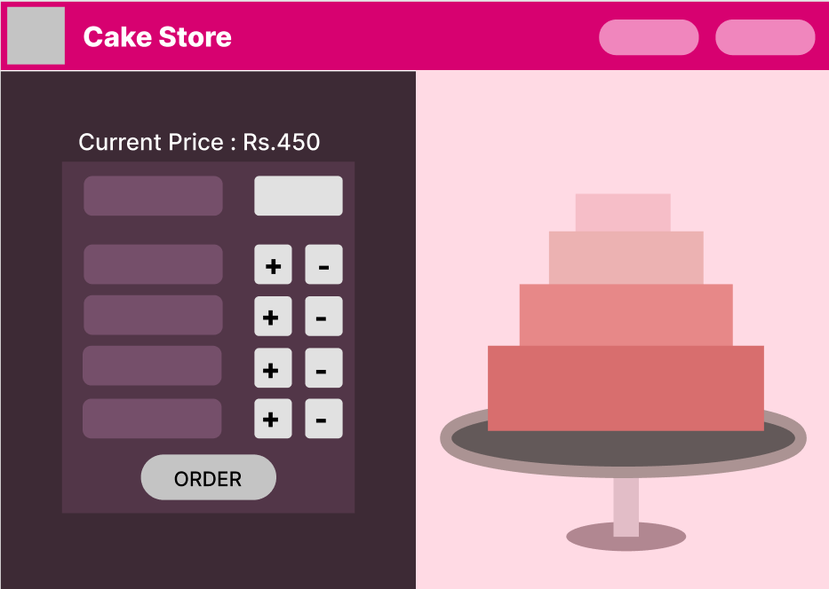
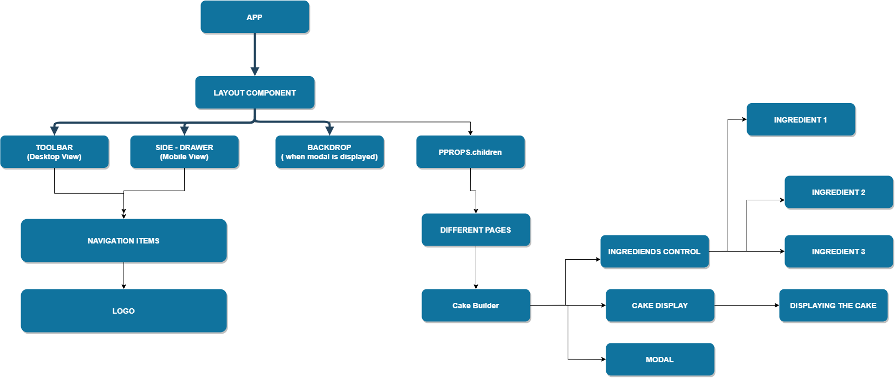

# The Cake Store
<br/>
<br/>
## To Run this Application In your Local Maching - 
<br/>
### Pre-requisites - 
    Make sure you have Node installed.
<br/>
Open your treminal and run the following Commands -
<br/>

``` 
git clone https://github.com/devartstar/Cake-Store.git
npm install
npm start
```

<br/>
<br/>
## About the Application -
<br/>
This application allows you to Customize and Build your own favourite cake. <br/>
It provies with a lot of options of Cake Size, Cake Flavour with a live preview. <br/>
It also allows you to place ordering of your cake to your Loved Ones.

### UI design
[Figma Design Link](https://www.figma.com/file/Ixbe4bU8sgMp3dLxucBuxN/Untitled?node-id=0%3A1)<br/>


### Project Planning

<br/>
[My prroject Plan Doc](https://docs.google.com/document/d/1ww76N1wsZHoqxcTdmpksQvTjspI-IQx54l7hGztA8WY/edit?usp=sharing)
<br/>
